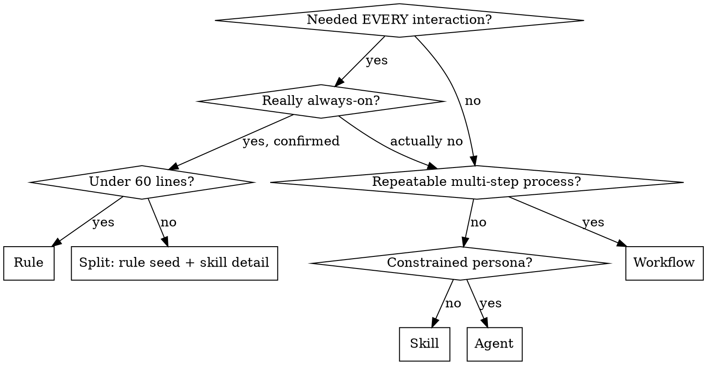

# Pack Content Craft

Writing pack content that actually changes agent behavior.

## The Iron Law

```
NO CONTENT WITHOUT BEHAVIORAL EVIDENCE
```

If you haven't watched an agent fail without this content, you don't know if the content teaches the right thing. This is TDD for documentation: no skill without a failing test, no rule without observed misbehavior.

**No exceptions:**
- Not for "obvious" best practices
- Not for "preventive" guidance
- Not for content that "seems useful"
- If you haven't seen the failure, you haven't earned the content

## Three Behavioral Tests

Every piece of pack content must pass all three before it ships.

### 1. Removal Test

Remove the content. Run the same task. Does the agent act differently?
- **Yes** → Content has behavioral impact. Keep it.
- **No** → Theater. Delete it.

### 2. Specificity Test

Does the content contain concrete actions, exact commands, or decision trees?
- **Yes** → Agent can follow it deterministically.
- **No** (says "consider X", "be careful about Y", "or equivalent") → Rewrite with specifics.

### 3. Rationalization Test

What excuses will the model generate to skip this guidance?
- **Excuses explicitly countered** → Content is hardened.
- **Excuses not addressed** → Model WILL find a way around it. Add counters.

## Which Construct?



Challenge every "yes" to "Needed EVERY interaction?" — rules consume tokens on every turn. The bar: would removing this from ANY interaction cause harm? If it's only relevant 30% of the time, it's a skill.

For detailed guidance on each construct, see references/construct-guide.md.

## TDD Loop for Pack Content

Follow RED-GREEN-REFACTOR. Same discipline as code TDD, applied to documentation.

### RED: Establish Baseline

1. Define a realistic task where the content should matter
2. Run the task WITHOUT the content (use a subagent or fresh conversation for isolation)
3. Document exactly what goes wrong:
   - What choices did the agent make?
   - What rationalizations did it use? (capture verbatim)
   - Where did ambiguity cause the wrong action?

If the agent does fine without the content, you don't need the content. Stop.

### GREEN: Write Minimal Content

1. Address ONLY the specific failures observed in RED
2. Don't add content for hypothetical failures
3. Write the minimum that changes the behavior
4. Rerun the same task WITH the content
5. Agent should now comply where it previously failed

If it still fails, the content isn't specific enough. Rewrite, don't add more.

### REFACTOR: Harden

1. Run additional scenarios — vary the pressure
2. Watch for NEW rationalizations the agent invents
3. Add explicit counters for each new rationalization
4. Build rationalization table from all observed excuses
5. Re-test until the content is bulletproof

For patterns and techniques to use in your content (iron laws, rationalization tables, red flags lists, degrees of freedom), see behavioral-patterns.md.

## CSO (Claude Search Optimization)

How to write skill descriptions that trigger correctly.

**The Rule:** Description = WHEN to use. Never WHAT it does or HOW it works.

**Why:** Testing proved that when a description summarizes the skill's workflow, the agent follows the description instead of reading the full skill body. The description becomes a shortcut that bypasses the detailed content.

**Format:**
- Start with "Use when..."
- Include concrete triggers: symptoms, situations, task types
- Write in third person (injected into system prompt)
- Keep under 500 characters

```yaml
# BAD: Summarizes workflow — agent shortcuts the body
description: Use for writing pack content — choose construct, apply three tests, TDD loop

# GOOD: Triggering conditions only — agent must read body for methodology
description: Use when creating, editing, or reviewing any pack content (rules, skills, workflows, agents) to ensure it actually changes agent behavior
```

## Red Flags — Content Authoring Rationalizations

| Excuse | Reality |
|--------|---------|
| "This best practice is obvious" | If obvious, the model already knows it. Don't write it. |
| "Better safe than thorough testing" | Untested content = untested code. You don't know if it works. |
| "I'll test it later" | Same as TDD: test-after proves nothing about behavior change. |
| "This is just a small addition" | Small additions compound into bloat. Every line must earn its place. |
| "The agent should know this" | If it should, it does. If it doesn't, your content must be specific enough to change that. |
| "Consider/be careful about X" | Vague guidance = theater. What SPECIFIC action should the agent take? |
| "Or equivalent" | Agent doesn't know what's equivalent. Decision tree or exact specification. |
| "This prevents future problems" | Content addresses OBSERVED failures, not hypothetical ones. |

**All of these mean: Apply the three behavioral tests. If it fails any, rewrite or delete.**

## References

- **Construct details:** See references/construct-guide.md
- **Behavioral patterns:** See behavioral-patterns.md
- **Authoring standard:** See authoring-standard.md (voice, structure, templates, frontmatter, checklists)
- **Governance criteria:** See references/governance-criteria.md (tier model, BiC cap, admission/demotion)
- **Quality dimensions:** See references/quality-dimensions.md (0-5 review lens per vector)
- **Curation procedures:** See references/curation-procedures.md (add/review/remove content)
- **Review guide:** See references/review-guide.md (three-level review criteria)
- **Audit script:** See scripts/pack-audit.sh (structural metrics extraction)
- **TDD cycle:** If a test-driven-development skill is available (e.g., from a co-distributed pack), invoke it for the RED-GREEN-REFACTOR methodology. If not, the TDD Loop section above is self-contained.
