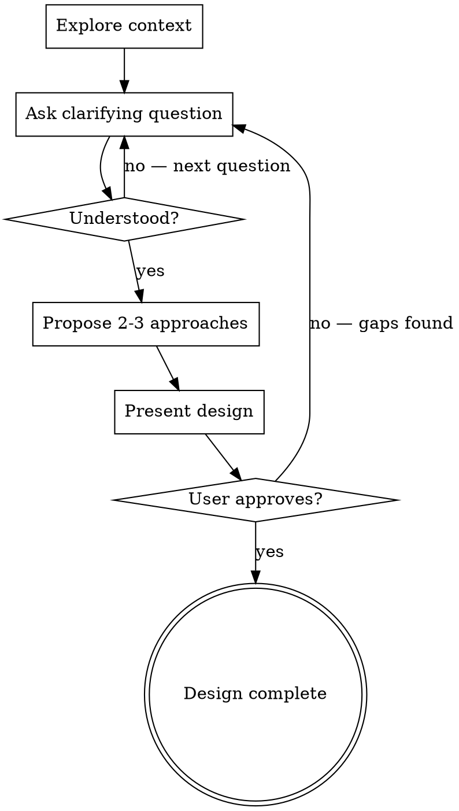

# Brainstorming Ideas Into Designs

Collaborative dialogue that turns ideas into approved designs before any code is written.

## The Iron Law

```
NO IMPLEMENTATION WITHOUT AN APPROVED DESIGN
```

Every project goes through this process. A todo list, a single-function utility, a config change — all of them. "Simple" projects are where unexamined assumptions cause the most wasted work. The design can be short, but you MUST present it and get approval.

**No exceptions:**
- Not for "trivial" changes
- Not for things you've built before
- Not for things the user says are simple (they're telling you what, not how)
- Not when the user says "just do it" (present the design quickly, but present it)

**Violating the letter of this rule IS violating the spirit.**

## When NOT to Use

- Bug fixes with a clear root cause — fix the bug
- Mechanical refactors (rename, extract, move) — just do them
- Config changes the user specified exactly — apply them
- One-line changes where the design IS the description

This skill is for work where WHAT to build or HOW to build it has open questions.

## The Design Loop



## Protocol

### Step 1: Explore Context

Before asking anything, check:
- Project structure (files, directories, build system)
- Recent changes (commits, branches, in-progress work)
- Existing patterns (how similar things are done in this codebase)

State what you found in 2-3 sentences. Do not dump file listings.

### Step 2: Ask Clarifying Questions

One question per message. No exceptions.

- Prefer multiple-choice when the option space is bounded
- Open-ended when the user needs to express intent or constraints
- Focus on: purpose, users, constraints, success criteria, non-goals
- Stop when you can describe what you're building and the user would say "yes, that's it"

### Step 3: Propose Approaches

Present 2-3 approaches with trade-offs:
- Lead with your recommendation and why
- Name each approach (not "Option A" — give descriptive names)
- State trade-offs in terms the user cares about (effort, risk, flexibility)
- Apply YAGNI ruthlessly — cut features that aren't needed for the stated goal

### Step 4: Present the Design

Present in conversation. Scale each section to its complexity — a sentence for the obvious, a paragraph for the nuanced.

Cover what's relevant (skip what isn't):
- Architecture and components
- Data flow
- Error handling strategy
- Key interfaces / contracts
- Testing approach

Ask after each section whether it looks right. Do not present the entire design as a wall of text.

### Step 5: Get Approval

The design is not approved until the user says it is. "Looks good" counts. Silence does not.

If the user wants the design written to a file, write it where they say. If they don't ask, don't create one — the conversation IS the record.

## Rationalization Table

| Excuse | Reality |
|--------|---------|
| "This is too simple for a design" | Simple projects have the most unexamined assumptions. Present a short design. |
| "The user seems impatient" | A 30-second design prevents a 30-minute redo. Move fast through the steps, don't skip them. |
| "I already know how to build this" | You know how YOU would build it. You don't know how the USER wants it built. Ask. |
| "The user said 'just build it'" | Present the design quickly. If they confirm, you've lost 15 seconds. If they correct you, you've saved an hour. |
| "I'll design as I go" | That's called prototyping without a spec. The user didn't ask for a prototype. |

## Red Flags

You are going off-protocol if:
- You asked more than one question in a single message
- You started writing code before the user approved a design
- You skipped approaches and jumped straight to a design (the user didn't see alternatives)
- You wrote a design doc file without the user requesting one
- You presented the full design in one message without checking sections incrementally

## Degrees of Freedom

| Scope | Design Depth | Approach |
|-------|-------------|----------|
| Single function or config | 2-3 sentences | Quick: context → 1 question → short design → approve |
| New feature in existing system | Paragraph per section | Standard: full protocol, 3-5 questions, sectioned design |
| New system or major rework | Detailed sections, possibly multi-pass | Thorough: extensive questions, propose architectures, iterate on design |
| Uncertain scope | Start minimal, expand if needed | Adaptive: begin as quick, escalate when complexity emerges |

## After Design

Once the user approves the design, route to the next step:

- **Design approved, ready to plan work** → Break it into tasks. If the writing-plans skill is available, invoke it.
- **Design revealed unknowns** → Research first. If the deep-research skill is available, invoke it.
- **Design is informational only** (user was exploring, not building) → Done.

Do not jump from design to implementation. An approved design produces shared understanding — a separate step turns understanding into a work plan.
