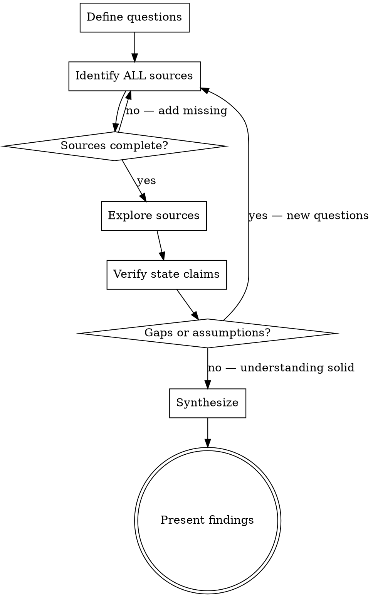

# Deep Research & Synthesis

Disciplined exploration that builds accurate understanding before acting.

## The Iron Law

```
NO SYNTHESIS WITHOUT SOURCE VERIFICATION
```

If you haven't verified your understanding against primary sources, you're synthesizing assumptions. Every claim about system state, architecture, or behavior must trace to a verified source — not memory, not inference, not "it should be."

**No exceptions:**
- Not for things you "already know"
- Not for things that "seem obvious" from context
- Not for things the user mentioned (verify anyway — they may be testing, approximate, or out of date)
- If you haven't checked the actual source, you haven't verified

**Violating the letter of this rule IS violating the spirit.**

## When NOT to Use

- Reading a specific file the user pointed you at — just read it
- Simple factual lookups (one source, one answer)
- Tasks where you already have verified state from earlier in this conversation

This skill is for COMPLEX exploration across multiple sources where incomplete understanding leads to wrong conclusions.

## The Exploration Loop



### Step 1: Define Questions

Before exploring anything, state explicitly:
- What specific questions need answers?
- What would "complete understanding" look like for this task?
- What is explicitly OUT of scope?

### Step 2: Identify ALL Sources

List every relevant source BEFORE exploring any of them:

| Source Type | Examples | Priority |
|-------------|----------|----------|
| **Config/state files** | sync-config, profiles, pack.json, .env, kubeconfig | PRIMARY — ground truth |
| **Runtime state** | `aipack doctor`, `git status`, `kubectl get`, process lists | PRIMARY — current reality |
| **Code** | Source files, scripts, modules | SECONDARY — shows intent |
| **Documentation** | README, AGENTS.md, comments, wikis | SECONDARY — may be stale |
| **Conversation context** | What the user said, prior tool results | TERTIARY — verify independently |
| **Memory/training** | What you "know" | NEVER PRIMARY — always verify |

**Critical:** Config and state sources are primary. Code and docs are secondary. If a system has a config file, registry, or state store — that's ground truth, not the README.

### Step 3: Explore Sources

**Parallelize independent sources.** Use subagents when:
- Sources are independent (reading source A doesn't inform what to read in source B)
- Each source requires significant exploration (>5 file reads)
- Time matters more than token efficiency

**Go sequential when:**
- One source informs which others to check
- You're building understanding incrementally
- The exploration space is small

**Depth calibration:**
- First pass: scan structure (ls, glob, manifest files, config files)
- Second pass: deep-read what's relevant based on scan
- Don't deep-read everything. Don't skim everything. Scan then focus.

### Step 4: Verify State Claims

Before reasoning about any system's current state:

1. **Read actual config/state files** — not code that references them
2. **Run status commands** where available (`aipack doctor`, `git status`, `kubectl get`)
3. **Cross-reference** findings against assumptions — what did you expect vs. what's actually there?
4. **List what you haven't checked** — unknown unknowns become known unknowns

This step catches the most common research failure: reasoning from an incomplete or stale picture.

### Step 5: Synthesize

Structure findings around four dimensions:

- **Patterns** — What's consistent across sources?
- **Gaps** — What's MISSING? What questions remain unanswered?
- **Contradictions** — Where do sources disagree? Which is authoritative?
- **Implications** — What does this understanding mean for the task at hand?

Don't just report what you found. Raw findings without interpretation is a dump, not research. The synthesis IS the value.

## Red Flags — Research Rationalizations

| Excuse | Reality |
|--------|---------|
| "I already know how this works" | Memory ≠ verification. Check the source. |
| "The user told me X" | Verify anyway. Users approximate, test, or have stale information. |
| "I've read enough to understand" | Have you checked config/state files? If not, you're guessing. |
| "This source probably isn't relevant" | "Probably" = assumption. Check or explicitly scope out with justification. |
| "I'll verify later" | Synthesis on unverified data = fiction. Verify first. |
| "The code tells me the state" | Code shows intent. Config/state shows reality. They diverge. |
| "I can infer this from context" | Context snippets ≠ source of truth. An env var in a system prompt doesn't tell you where it came from. |

**All of these mean: Go back to Step 4 (Verify State Claims).**

## Degrees of Freedom

| Task Type | Exploration Depth | Approach |
|-----------|-------------------|----------|
| "What is X?" (factual) | Narrow — find authoritative source | Single source, verify, done |
| "How does X work?" (systems) | Medium — multiple sources, cross-reference | Scan structure → deep-read key files |
| "What should we build?" (design) | Broad — comprehensive exploration, synthesis matters most | Parallel subagents, thorough synthesis |
| "What's wrong with X?" (diagnostic) | Narrow on evidence, broad on interpretation | Verify ALL state first, then reason |
| "How does this ecosystem fit together?" (architecture) | Broad — every config, profile, manifest | State files first, code second, docs last |

## After Research

Once findings are synthesized, route to the appropriate next step:

- **Findings reveal work to do** → Break it down before starting. If the task-decomposition skill is available, invoke it.
- **Findings reveal a system issue** → Triage before fixing. If the operational-triage skill is available, invoke it.
- **Findings are informational** → Present synthesis. Done.

Do not jump from research directly to implementation. Research produces understanding — a separate step turns understanding into action.
