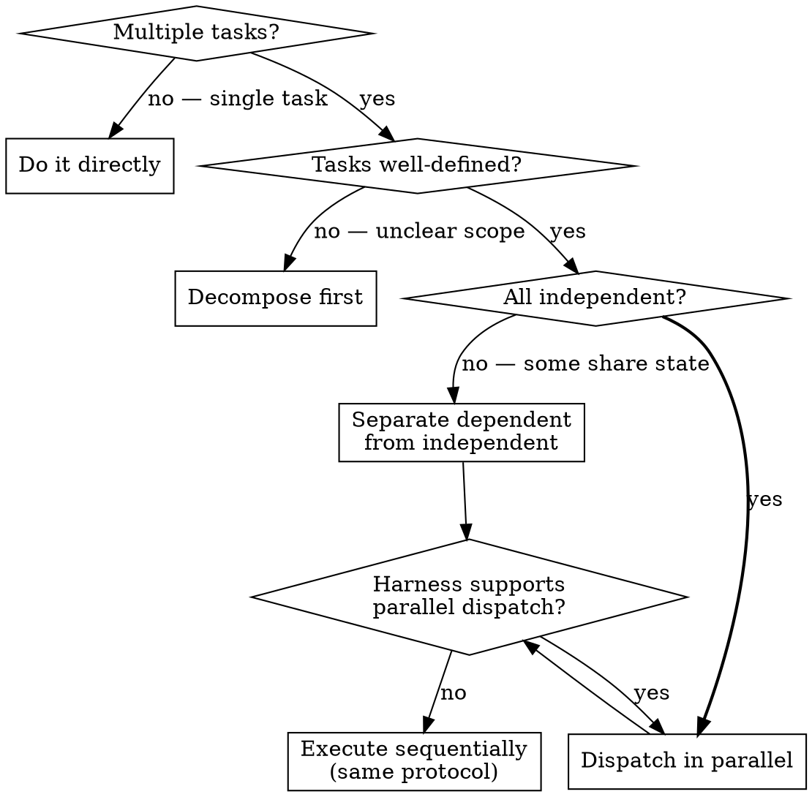

# Dispatching Parallel Agents

Coordinate independent work streams across parallel agents to solve N problems in the time of one.

## The Iron Law

```
DO NOT PARALLELIZE DEPENDENT TASKS
```

If Task B reads state that Task A writes, they are not independent. If two tasks edit the same file, they are not independent. If fixing one problem might fix another, they are not independent. Sequential execution is not a failure — false parallelism that produces conflicts and wasted work is.

**No exceptions:**
- Not when "they'll probably touch different parts of the file"
- Not when "one should finish before the other gets there"
- Not when the tasks feel unrelated but share a config, lock, or resource
- If you cannot prove independence, serialize

**Violating the letter of this rule IS violating the spirit.**

## When NOT to Use

- Single task, even if large — decompose first, then decide
- Tasks with sequential dependencies (output of A feeds input of B)
- Tasks that edit the same files or compete for the same resources
- Exploratory work where you don't yet know the problem boundaries
- Harness does not support parallel dispatch (use sequential fallback)

This skill is for KNOWN independent tasks where the boundaries are clear before dispatch.

## Decision Tree



## Protocol

### Step 1: Identify Tasks

List every discrete work item. For each, state:
- What it does (one sentence)
- What files/resources it reads
- What files/resources it writes
- What its success criteria are

### Step 2: Verify Independence

Run every pair through the independence checklist (below). Any failure = those tasks serialize.

### Step 3: Compose Task Prompts

Each dispatched task gets a self-contained prompt:
- **Scope:** Exactly what to do and what NOT to do
- **Context:** All information needed — do not assume shared state between agents
- **Constraints:** Which files/directories are in scope; everything else is off-limits
- **Output:** What to return (summary of changes, findings, or artifacts)

A task prompt that requires reading another task's output is not independent.

### Step 4: Dispatch

- **Parallel-capable harness:** Dispatch all independent tasks simultaneously
- **Sequential fallback:** Execute tasks one at a time using the same prompt structure; do not let results from Task A leak into Task B's prompt unless you are intentionally serializing dependent work

### Step 5: Collect and Verify

When all tasks complete:
1. Read every task's output summary
2. **Spot-check agent claims.** Agents can report success on failed edits. For file-editing tasks, read a sample of modified files to confirm changes actually landed. The higher the file count, the more samples needed.
3. Check for unexpected file overlaps (tasks may discover shared concerns not visible beforehand)
4. Run project-level verification (full test suite, lint, build)
5. If any task failed, preserve successful results — do not re-run everything

## Independence Checklist

Before dispatching, verify each pair of tasks against ALL of these:

| Check | Pass | Fail |
|-------|------|------|
| **File writes** — do they write to any of the same files? | Disjoint write sets | Any overlap |
| **Read-write** — does one read what another writes? | No cross-dependencies | Any dependency |
| **Shared resources** — database, API quota, lock file, port? | No shared resources | Any contention |
| **Causal link** — could fixing one make the other unnecessary? | Independent root causes | Possibly related |
| **Ordering** — does the correctness of one depend on the other completing first? | Order irrelevant | Order matters |

ALL checks must pass for a pair to be independent. One failure = serialize that pair.

## Red Flags — Parallelism Rationalizations

| Excuse | Reality |
|--------|---------|
| "They're in different files" | Files =/= independence. Two files can share state through imports, config, or side effects. |
| "They'll probably finish before conflicting" | "Probably" is a race condition. Prove independence or serialize. |
| "We can merge the conflicts after" | Merge conflicts between parallel agents are expensive. Prevent, don't repair. |
| "It's faster to parallelize" | It's faster only when tasks are independent. False parallelism is slower than sequential. |
| "Each agent is smart enough to avoid conflicts" | Agents don't coordinate. They can't see each other's work in progress. |

**All of these mean: Go back to the Independence Checklist.**

## Degrees of Freedom

| Scenario | Tasks | Approach |
|----------|-------|----------|
| Test failures across unrelated files | 1 per file/subsystem | Parallel — disjoint by definition |
| Bug fix + documentation update | 2 | Parallel — if docs describe existing behavior, not the fix |
| Multiple config changes to same system | N | Serialize — shared config state |
| Research across independent domains | 1 per domain | Parallel — read-only exploration |
| Refactor + feature in same module | 2 | Serialize — shared file writes |
| Multi-repo changes with no cross-deps | 1 per repo | Parallel — isolated by repository boundary |

## After Parallel Completion

Once results are collected and reconciled:

- **Results reveal follow-up work** — some tasks may surface new tasks. Re-enter Step 1 with the new set.
- **Integration conflicts detected** — serialize the conflicting subset manually. Do not re-dispatch.
- **All results clean** — run final verification, report outcomes. Done.

Do not skip reconciliation. Parallel agents produce independent results that must be validated together before the work is complete.
