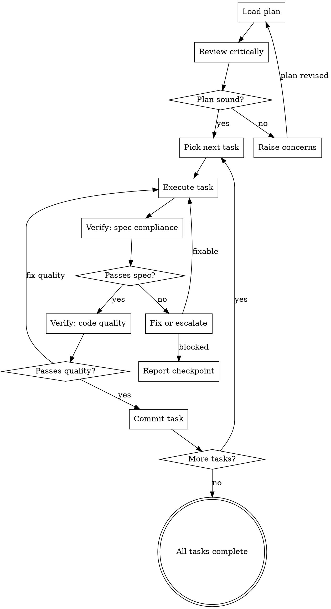

# Executing Plans

Execute a plan task by task with verification and commit after each. Report at checkpoints.

## The Iron Law

```
NO TASK STARTS UNTIL THE PREVIOUS TASK IS VERIFIED AND COMMITTED
```

A plan is a sequence of verified steps, not a batch of hopeful changes. Each task must pass its verification before you touch the next one. Each verified task gets its own commit. Batching commits across tasks destroys bisectability and rollback safety.

**No exceptions:**
- Not for "trivial" tasks that "obviously work"
- Not for tasks that "only change one line"
- Not when you're "almost done and want to wrap up"
- Not when verification "takes too long"

**Violating the letter of this rule IS violating the spirit.**

## When NOT to Use

- Single-step changes — just do them
- Exploratory work where the path is unknown — use research or brainstorming first
- You don't have a written plan — use the writing-plans skill first
- The plan is a checklist of independent items with no ordering dependency — execute directly

This skill is for SEQUENTIAL execution of a multi-task plan where each task builds on the last.

## The Execution Loop



### Step 1: Load and Review Plan

1. Read the plan file
2. Review critically — identify gaps, ambiguities, missing verifications, ordering problems
3. If concerns exist: raise them with the user BEFORE starting execution
4. If the plan is sound: announce "Executing plan: [plan name/file]. [N] tasks."

### Step 2: Execute One Task

For each task in order:

1. State which task you are starting and what it does (one line)
2. Follow the plan's steps exactly — the plan was written with specific steps for a reason
3. If the plan says to use a fresh context or separate session, do so when the harness supports it
4. If you must deviate from the plan, state why before deviating

### Step 3: Two-Stage Verification

**Stage A — Spec Compliance:**
- Run the verification commands specified in the plan
- Confirm the task produces the output/behavior the plan specifies
- If tests exist, run them. If the plan specifies tests, run those specifically.

**Stage B — Code Quality:**
- Run linters, formatters, type checkers as configured in the project
- Check that the change follows existing patterns in the codebase
- Confirm the diff contains only changes required by this task

If either stage fails: fix the issue and re-verify. If the fix is non-trivial or reveals a deeper problem, stop and report.

### Step 4: Commit

After both verification stages pass:

1. Stage only files changed by this task
2. Commit with a message that describes what this task accomplished
3. Do NOT batch commits across tasks

### Step 5: Checkpoint Reporting

Report to the user after every 3 completed tasks, or when blocked. Include:

- Tasks completed since last checkpoint (with commit hashes)
- Verification results (pass/fail, command output)
- Current task if blocked, with the specific blocker
- Remaining task count

Say: "Ready for feedback." Then wait.

### Step 6: Handle Blockers

When a task fails verification or reveals an unexpected problem:

1. **Stop executing.** Do not skip the task and continue.
2. **Diagnose.** Is it a plan error, a code error, or a missing dependency?
3. **Report.** State what failed, what you tried, and what you think the fix is.
4. **Wait.** The user decides: fix and continue, revise the plan, or abandon.

## Red Flags — Execution Rationalizations

| Excuse | Reality |
|--------|---------|
| "I'll commit all of these together at the end" | Each task gets its own commit. No batching. |
| "This task is trivial, no need to verify" | Trivial tasks break builds. Verify. |
| "I'll skip this failing test and come back" | Skipping a failure poisons every task after it. Stop. |
| "The plan says X but Y is obviously better" | State the deviation and get approval. Plans exist for a reason. |
| "I'll run tests once at the end" | You'll find task 2 broke something and tasks 3-7 built on top. Verify each. |
| "This verification takes too long, it probably passes" | "Probably" is not evidence. Run it. |

## Degrees of Freedom

| Situation | Adjustment |
|-----------|------------|
| Plan has 2-3 tasks total | Skip checkpoint reporting — just execute and report at end |
| Harness supports subagents/fresh contexts | Use them for isolated tasks the plan marks as independent |
| Harness does NOT support subagents | Execute sequentially in current context — the pattern still works |
| Task verification is ambiguous in the plan | Use project's standard test/lint commands. If none exist, state what you checked. |
| User gave blanket "just execute it" | Still verify each task. Still commit each. Report at end instead of checkpoints. |

## After Execution

Once all tasks are verified and committed, route to the appropriate next step:

- **All tasks complete, branch ready** — Finalize the work. If the finishing-a-development-branch skill is available, invoke it.
- **A task revealed a deeper issue during execution** — Diagnose before continuing. If the systematic-debugging skill is available, invoke it.
- **Plan needs significant revision mid-execution** — Don't patch a broken plan. If the writing-plans skill is available, invoke it to revise.

Do not declare the work "done" at plan completion. Execution produces committed code — a separate step finalizes the branch.
