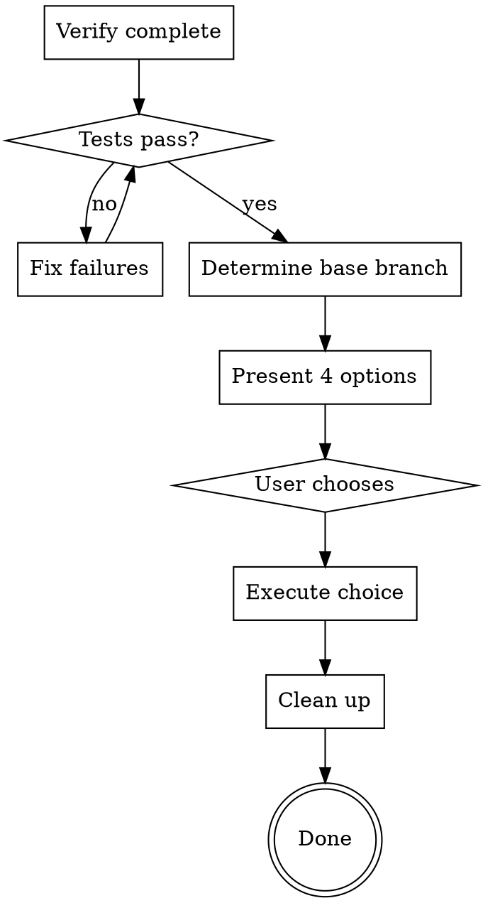

# Finishing a Development Branch

Present structured completion options after verifying the work is ready.

## The Iron Law

```
NO COMPLETION WITHOUT PASSING TESTS AND A CLEAN DIFF
```

If tests fail or uncommitted changes remain, the branch is not finished. Fix the failures, commit the work, THEN invoke this skill. No exceptions — not for "trivial" changes, not for "it was passing earlier," not for "I'll fix it after merge."

**Violating the letter of this rule IS violating the spirit.**

## When NOT to Use

- Work in progress — commit and test first, then come back
- Hotfix that must go out NOW — follow your incident process, not a skill
- Branch that someone else owns — coordinate with them directly

## Decision Flow



## Protocol

### Step 1: Verify Readiness

Run the project's test suite. Check for uncommitted changes.

```bash
# Detect test runner and execute
# npm test / cargo test / pytest / go test ./... / make test

# Confirm working tree is clean
git status --short
```

**If tests fail or uncommitted work exists:** Stop. Report failures. Do not proceed to Step 2.

**If clean and passing:** Continue.

### Step 2: Determine Base Branch

```bash
git log --oneline --graph --decorate -10
git merge-base HEAD main 2>/dev/null || git merge-base HEAD master 2>/dev/null
```

If ambiguous, ask: "This branch appears to have diverged from `<branch>` — is that correct?"

### Step 3: Present Options

Present exactly these 4 options. No added explanation. No recommendation.

```
Implementation complete. Tests pass. What would you like to do?

1. Merge back to <base-branch> locally
2. Push and create a Pull Request
3. Keep the branch as-is (I'll handle it later)
4. Discard this work

Which option?
```

Wait for the user's choice. Do not proceed without it.

### Step 4: Execute Choice

#### Option 1: Merge Locally

```bash
git checkout <base-branch>
git pull
git merge <feature-branch>
# Run tests again on merged result
<test command>
# Only delete branch if merge tests pass
git branch -d <feature-branch>
```

If post-merge tests fail, report the failures and stop. Do not delete the branch.

#### Option 2: Push and Create PR

```bash
git push -u origin <feature-branch>
```

Create a PR via the platform's CLI or API. Include:
- Title: concise summary of the change
- Body: 2-3 bullet summary, test plan checklist

Do not push to the base branch. Do not merge the PR.

#### Option 3: Keep As-Is

Report the branch name and current location. Take no further action.

#### Option 4: Discard

**Require explicit confirmation before any deletion:**

```
This will permanently delete:
- Branch: <name>
- Commits: <short log>

Type 'discard' to confirm.
```

Wait for the exact word "discard." Nothing else counts.

```bash
git checkout <base-branch>
git branch -D <feature-branch>
```

### Step 5: Clean Up

For Options 1, 2, and 4 — check for and remove any associated workspace artifacts (worktrees, temp files, build artifacts specific to the branch).

For Option 3 — no cleanup. Leave everything in place.

## Rationalization Table

| Excuse | Reality |
|--------|---------|
| "Tests were passing a minute ago" | Run them now. State changes between steps. |
| "It's a small change, skip verification" | Small changes break builds. 10 seconds to confirm. |
| "I'll just merge, user probably wants that" | Present options. User chooses. No assumptions. |
| "Discard confirmation is overkill" | Deleted branches are gone. Confirmation is cheap. |
| "I can clean up the branch later" | If you're cleaning up now, clean up completely. |
| "Post-merge tests will definitely pass" | "Definitely" is not evidence. Run them. |

## Red Flags

**Stop immediately if:**
- Tests fail at any point — do not proceed past the failing gate
- User hasn't chosen an option — do not default to any action
- Discard requested without explicit "discard" confirmation — do not delete
- Force-push considered — never without explicit user request
- Base branch is ambiguous — ask, do not guess

## Degrees of Freedom

| Situation | Approach |
|-----------|----------|
| Single commit, clean history | Fast-forward merge is fine for Option 1 |
| Multiple commits, messy history | Offer squash as a sub-option under Option 1 or 2 |
| PR platform unavailable | Option 2 becomes push-only; note PR must be created manually |
| No remote configured | Options 2 and 3-with-push are unavailable; say so |
| Monorepo with selective tests | Run only tests relevant to changed paths |
