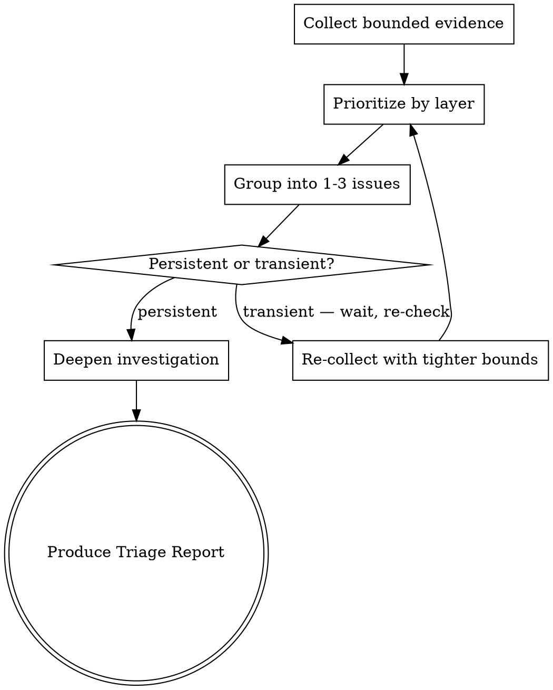

# Operational Triage

Turning noisy system signals into prioritized, actionable findings.

## The Iron Law

```
EVIDENCE BEFORE INTERPRETATION
```

State what you observe before explaining what it means. Separate observation from hypothesis. An error message is evidence. "The database is overloaded" is interpretation — and it might be wrong.

**No exceptions:**
- Not for "obvious" failures ("it's clearly a timeout")
- Not for things you've seen before ("this always means X")
- Not when under time pressure ("let me just check if it's X")
- If you haven't stated the raw evidence, you haven't earned the interpretation

## Safety Posture

- Default to **read-only** commands. Prefer list/get/describe/logs over any state change.
- Bound evidence collection: use `--since`, `--tail`, `--limit`, time windows, filters. Never dump unbounded logs.
- Sanitize before sharing: no tokens, passwords, keys, sensitive identifiers, or internal URLs unless needed for diagnosis.
- If any investigation step could mutate state, stop and apply the mutation gate (see mutation-awareness rule).

## The Triage Loop



### Step 1: Collect Bounded Evidence

Before interpreting anything, gather raw signals with explicit bounds:

- **Logs**: `--since=15m --tail=200`. Adjust flags for your tool (journalctl, kubectl logs, etc.) but always bound time and count. Never unbounded.
- **Events/alerts**: last N minutes, filtered to warnings/errors.
- **Status**: current state of controllers, services, infrastructure.
- **Metrics**: if available, narrow to the relevant time window.

If evidence is overwhelming, tighten bounds (shorter window, specific component, specific namespace). If evidence is sparse, widen carefully.

### Step 2: Prioritize by System Layer

Not all signals are equal. Work top-down through the system:

| Priority | Layer | Examples | Why First |
|----------|-------|----------|-----------|
| 1 | **Control plane / orchestration** | API servers, controllers, operators, schedulers | If the brain is broken, symptoms everywhere are secondary |
| 2 | **Infrastructure** | Nodes, networking, storage, compute capacity | Infra failures cause widespread workload symptoms |
| 3 | **Platform services** | Databases, queues, caches, auth services | Shared services affect multiple workloads |
| 4 | **Workloads / applications** | Pods, containers, application processes | Usually symptoms of higher-layer issues |

**The principle:** Fix the highest layer first. A node being down explains 50 pod failures — investigating individual pods is wasted effort.

### Step 3: Group Into 1-3 Issues

Turn noisy signals into a small number of distinct issues:

- **Group by root cause signal**: same error reason, same affected component, same failure pattern
- **Group by blast radius**: one namespace vs. many, one node vs. cluster-wide
- **Aim for 1-3 issues maximum.** More than 3 = you haven't grouped enough, or the scope is too large for one triage pass.

### Step 4: Verify Persistence

Before escalating or acting on any issue:

- **Is an operation in progress?** (upgrade, deployment, reconciliation) → Wait 10-15 minutes and re-check.
- **Is the signal still present?** → Re-collect bounded evidence for the specific issue.
- **Still there after re-check** → Persistent. Proceed to deepen investigation.
- **Gone after re-check** → Transient. Document as recovered, note the time window.

### Step 5: Route to Next Step

Based on findings, choose ONE next action:

- **Single component dominates** and rest is healthy → Deep-dive into that component (logs, describe, config)
- **Multiple layers affected** → Stay at the current layer, focus on the highest-priority issue
- **Root cause identified** → Propose fix (with mutation gate if it changes state)
- **Root cause unclear** → Collect more evidence from a different angle (metrics, config, recent changes)
- **Beyond your access or knowledge** → Escalate with the Triage Report

## The Triage Report

Every triage ends with a structured report. This format works for handoffs, incident tickets, and your own notes:

```markdown
## Triage Report

**Context:** [system/cluster/environment, sanitized]
**Time window:** [when the investigation was conducted]

**Signals collected:**
- [command/tool → what it showed, bounded]

**Top issues (prioritized):**
1. [Issue: evidence summary, blast radius, severity]
2. [Issue: evidence summary, blast radius, severity]

**Likely causes:**
- [Hypothesis tied to specific evidence — not speculation]

**Next steps (read-only unless mutation-gated):**
- [Specific next command/investigation/escalation]

**Escalation / handoff:**
- [What to include if passing to someone else]
```

## Red Flags — Triage Rationalizations

| Excuse | Reality |
|--------|---------|
| "I know what this is" | State the evidence first. You might be wrong. |
| "Let me just try fixing it" | Investigate before fixing. Fixes without root cause create new problems. |
| "There are too many errors to triage" | Tighten bounds. Prioritize by layer. Group by cause. 1-3 issues. |
| "This is probably transient" | "Probably" = assumption. Re-check after 10-15 minutes to verify. |
| "I need to see all the logs" | Unbounded logs are noise. Bound first, expand only if bounded view is insufficient. |
| "The user wants a quick answer" | A wrong quick answer is worse than a correct slower one. Evidence first. |

**All of these mean: Go back to Step 1 (Collect Bounded Evidence) or Step 4 (Verify Persistence).**

## Degrees of Freedom

| Situation | Depth | Approach |
|-----------|-------|----------|
| Single clear error, one component | Narrow | Steps 1-2, verify persistence, propose fix |
| Multiple warnings, unclear scope | Medium | Full loop, 1-3 issues, triage report |
| System-wide degradation | Broad | Layer-by-layer, focus on highest priority, escalate early |
| "Is this normal?" (no clear error) | Narrow | Collect baseline evidence, compare to expected state, report |

## After Triage

Once the triage report is produced, route to the appropriate next step:

- **Root cause needs deeper investigation** → Targeted research. If the deep-research skill is available, invoke it with specific questions from the triage report.
- **Fix identified and scoped** → Plan the fix. If the task-decomposition skill is available, invoke it to break down the remediation.
- **Escalation needed** → Present triage report for handoff. Done.

Do not jump from triage directly to fixing. Triage identifies and prioritizes — a separate step plans the fix.
