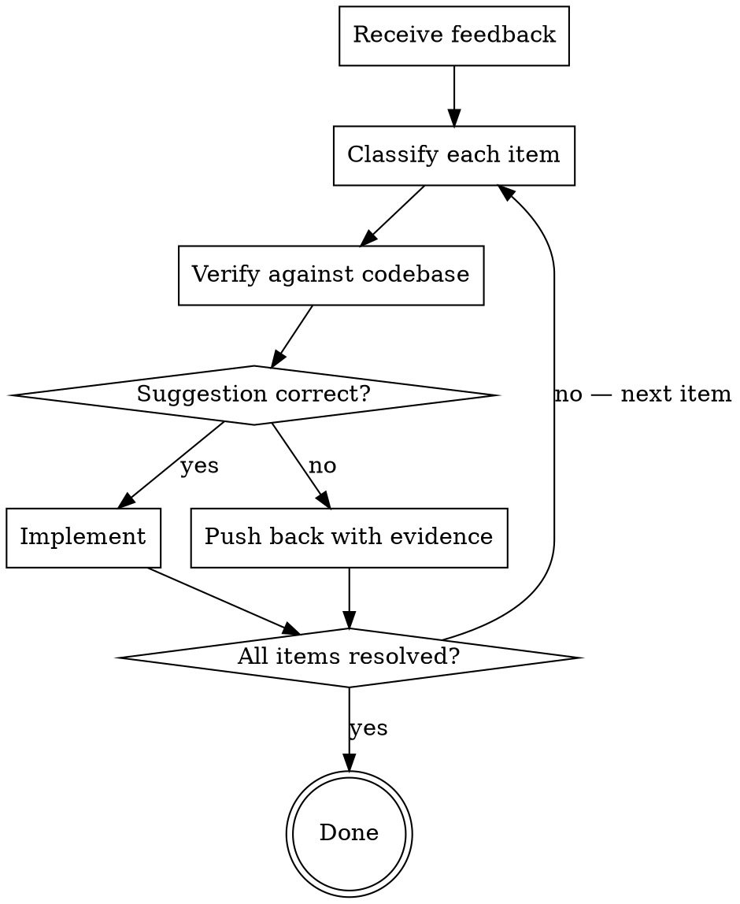

# Receiving Code Review

Evaluate review feedback with technical rigor before implementing anything.

## The Iron Law

```
VERIFY FEEDBACK BEFORE IMPLEMENTING
```

Review feedback is input to evaluate, not instructions to execute. Every suggestion must be verified against the actual codebase before implementation. Performative agreement ("Great point!") and blind implementation are both failures — they substitute social comfort for technical correctness.

**No exceptions:**
- Not for feedback that "sounds right"
- Not for feedback from senior reviewers or domain experts
- Not for feedback that matches your intuition
- If you haven't verified the suggestion against the code, you haven't evaluated it

**Violating the letter of this rule IS violating the spirit.**

## When NOT to Use

- Typo fixes, formatting corrections, or other objectively verifiable micro-feedback — just fix them
- You authored the review (requesting review is a different skill)
- Feedback is a direct instruction from the user in this session — that's a task, not a review

## The Review Reception Loop



## Protocol

### Step 1: Read All Feedback Before Reacting

Read every item completely. Do not start implementing after item 1 — items may be related, contradictory, or depend on each other. If any item is unclear, ask for clarification on ALL unclear items before implementing ANY item.

### Step 2: Classify Each Item

| Category | Signal | Treatment |
|----------|--------|-----------|
| **Correctness** | Bug, logic error, security issue, broken behavior | Verify the bug exists. If confirmed, fix. Highest priority. |
| **Architecture** | Design pattern, abstraction, structural concern | Check whether the suggestion fits THIS codebase's patterns. Discuss before implementing. |
| **Style** | Naming, formatting, idiom preference | Check project style guides / linters. Follow project convention, not reviewer preference. |
| **YAGNI** | "You should also add...", "Implement proper..." | Grep for actual usage. If nothing calls it, push back. |

Misclassifying an architecture concern as style (or vice versa) leads to wrong treatment. When uncertain, treat as architecture — it gets more scrutiny.

### Step 3: Verify Against the Codebase

For each non-trivial item:

1. **Check the actual code** — does the problem the reviewer describes exist?
2. **Check for context the reviewer may lack** — backward compatibility, platform constraints, upstream dependencies
3. **Check for regressions** — will this change break existing functionality?
4. **Check project conventions** — does the suggestion align with how this codebase already works?

If you cannot verify a suggestion, state what you would need: "Cannot verify without running X / checking Y. Proceeding as-is or should I investigate?"

### Step 4: Implement or Push Back

**When feedback is correct:** Fix it. State what changed. No performative gratitude.
- "Fixed — was using wrong comparison operator in the bounds check."
- "Good catch. Updated to use the project's existing retry helper instead."

**When feedback is wrong:** Push back with evidence, not defensiveness.
- "Checked — this API requires the legacy path for pre-13 compat. Current tests cover this."
- "Grepped the codebase — nothing calls this endpoint. Remove it (YAGNI)?"

**When you pushed back and were wrong:** Correct factually and move on.
- "Verified and you're correct. Implementing now."

### Step 5: Implementation Order

For multi-item feedback, implement in this order:
1. Clarify all unclear items FIRST
2. Blocking issues (correctness, security)
3. Simple fixes (typos, imports, naming)
4. Complex changes (refactoring, architecture)
5. Test each fix individually. Verify no regressions.

## Rationalization Table

| You're Thinking... | Reality |
|---------------------|---------|
| "Reviewer is more senior, they're probably right" | Seniority is not verification. Check the code. |
| "I'll just implement it, it's faster" | Implementing wrong suggestions creates more work than verifying. |
| "I should be receptive to feedback" | Receptive means evaluating honestly, not agreeing reflexively. |
| "This is a style issue, not worth arguing" | Check the project's conventions. Follow those, not personal preference. |
| "I already know this is correct" | Then verification takes 10 seconds. Do it anyway. |
| "I don't want to seem difficult" | Technical accuracy is not difficult. Silence on wrong suggestions is. |

**All of these mean: Go back to Step 3 (Verify Against the Codebase).**

## Red Flags

You are failing at this skill if you:
- Say "Great point!" or "You're absolutely right!" before checking anything
- Implement all suggestions in order received without classifying them
- Skip verification because the reviewer "seems to know what they're talking about"
- Avoid pushing back because of social dynamics
- Implement a suggestion that contradicts the project's existing patterns without flagging it
- Fix items 1, 2, 3 and defer 4, 5 instead of clarifying all unclear items first

## Degrees of Freedom

| Feedback Scope | Approach |
|----------------|----------|
| Single clear fix | Verify, implement, done |
| Multiple independent items | Classify all, implement in priority order |
| Architectural suggestion | Verify fit with codebase patterns, discuss before implementing |
| Contradicts prior decisions | Flag the conflict — do not silently override prior decisions |
| Cannot verify | State what's needed, ask for direction |

## After Review

Once all feedback items are resolved:

- **Changes were implemented** → Run the project's test/lint/build commands. Verify everything passes before marking resolved.
- **Pushback needs discussion** → Present your evidence and wait for resolution. Do not implement contested items speculatively.
- **Review revealed deeper issues** → If the systematic-debugging skill is available, invoke it for diagnostic work. If the task-decomposition skill is available, use it to break down larger remediation.

Do not mark review complete until every item is either implemented-and-verified or explicitly resolved through discussion.
