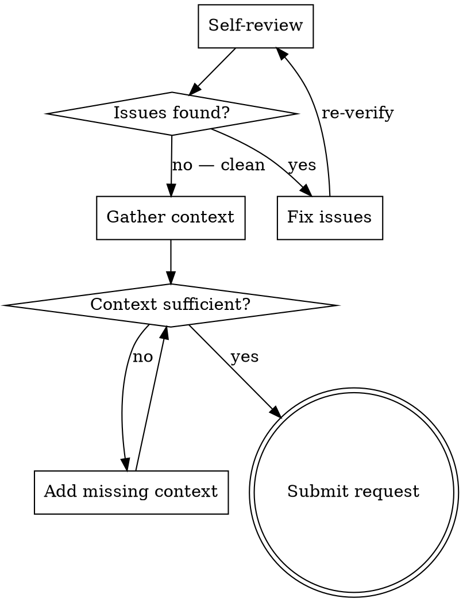

# Requesting Code Review

Prepare work for review by verifying it yourself first, then providing reviewers with the context they need to give useful feedback.

## The Iron Law

```
NO REVIEW REQUEST WITHOUT SELF-REVIEW
```

If you haven't verified your own work — tests passing, diff clean, no unintended files — you are wasting the reviewer's time on problems you could have caught. Every review request must follow a completed self-review.

**No exceptions:**
- Not for "trivial" changes
- Not for "I already tested it manually"
- Not for urgent fixes under time pressure
- Not for changes the reviewer "will understand anyway"

**Violating the letter of this rule IS violating the spirit.**

## When NOT to Use

- Single-line typo fixes with no behavioral change — just push
- Draft PRs explicitly marked as work-in-progress for early feedback
- Automated dependency bumps with passing CI

This skill is for SUBSTANTIVE changes where incomplete self-review leads to wasted review cycles.

## The Review Readiness Loop



### Step 1: Self-Review

Run through this checklist before involving anyone else:

1. **Tests pass.** Run the full test suite. Not "should pass" — run it, read the output.
2. **Diff is scoped.** Every changed line serves the stated goal. No drive-by reformatting, no unrelated import changes.
3. **No unintended files.** Check `git status` for accidentally staged files, generated artifacts, secrets, or binaries.
4. **Commit history is coherent.** Each commit has a clear purpose. Squash fixup commits.
5. **Build succeeds.** If the project has a build step, run it.
6. **Lint passes.** If the project has a linter, run it.

If ANY item fails, fix it before proceeding. Do not request review of broken work.

### Step 2: Gather Context

Provide reviewers with everything they need to evaluate the change without asking you questions:

**Required context:**
- What changed and why (not a diff summary — the INTENT)
- How to verify the change works (test commands, manual steps, or both)
- Base and head commits (or branch comparison)

**Contextual enrichment via MCP tools (when available):**
- Link the originating ticket or issue (Atlassian, GitHub Issues)
- Reference related PRs or dependent changes (Bitbucket, GitHub)
- Note deployment implications (deployment tooling, release pipelines)

**Skip what's obvious from the diff.** Reviewers read code. Tell them what the code doesn't show: constraints, trade-offs, rejected alternatives.

### Step 3: Submit the Review Request

Structure the request:

1. **Title:** One line — what this change does (under 70 characters)
2. **Summary:** 1-3 bullets covering intent, scope, and risk
3. **Test plan:** How you verified it. How the reviewer verifies it.
4. **Context links:** Tickets, related PRs, documentation touched

After submitting, do NOT continue building on unreviewed work unless the next task is independent.

## Rationalization Table

| Excuse | Reality |
|--------|---------|
| "It's a small change, no review needed" | Small changes break production. Size does not determine risk. |
| "Tests pass so it's fine" | Tests verify behavior, not intent. Reviewers catch design issues tests miss. |
| "I'll clean up the diff later" | Reviewers see the diff NOW. Noise wastes their time and hides real issues. |
| "The reviewer knows the context" | They don't. They have 20 other things in their head. Spell it out. |
| "I already got verbal approval" | Verbal approval is not code review. The diff needs eyes. |
| "CI will catch any problems" | CI catches build and test failures. It does not catch wrong abstractions, missing edge cases, or unclear intent. |

## Red Flags

You are skipping self-review if:
- You feel impatient about "just getting it reviewed"
- You catch yourself thinking "the reviewer will find anything I missed"
- Your diff includes files you didn't intentionally change
- You cannot explain the purpose of every changed line
- Your test suite has not run since your last code change

## Degrees of Freedom

| Change Type | Self-Review Depth | Context Needed |
|-------------|-------------------|----------------|
| Bug fix | Verify fix + regression test exists | Reproduction steps, root cause, fix rationale |
| New feature | Full checklist, edge case review | Requirements link, design decisions, test coverage |
| Refactor | Verify behavior unchanged (before/after tests) | Why now, what improves, what stays the same |
| Config change | Verify in target environment | Blast radius, rollback plan |
| Dependency update | Check changelog for breaking changes | What changed, why update now, compatibility notes |

## After Review Request

Once the review request is submitted, route to the appropriate next step:

- **Review feedback received** → Process it systematically. If the receiving-code-review skill is available, invoke it.
- **Self-review revealed issues to fix first** → Diagnose and fix before re-requesting. If the systematic-debugging or test-driven-development skill is available, invoke the relevant one.
- **Review approved, no changes needed** → Merge and move on.
