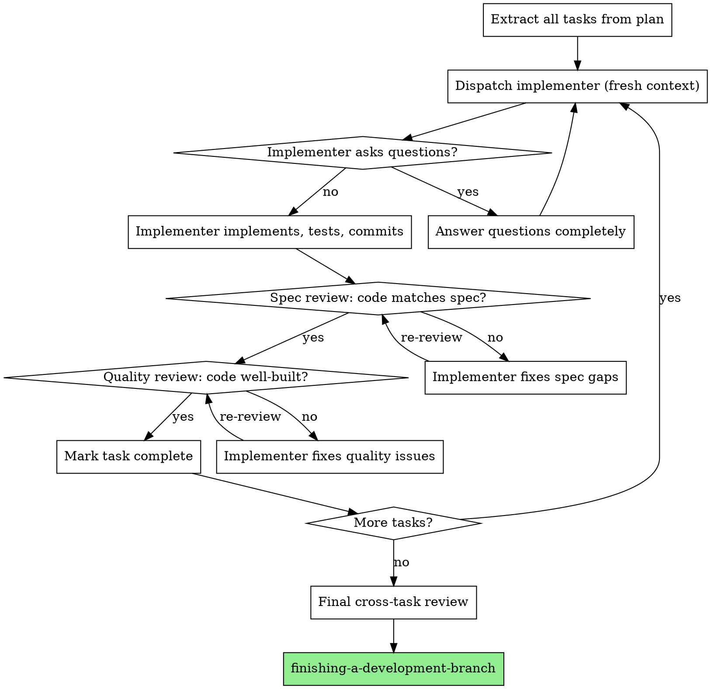

# Subagent-Driven Development

Dispatch a fresh agent context per task, with two-stage review after each: spec compliance first, then code quality.

## The Iron Law

```
NEVER LET A SUBAGENT GUESS — ANSWER ITS QUESTIONS OR PROVIDE THE CONTEXT IT NEEDS
```

A subagent working from assumptions produces plausible code that misses the point. Every question from a subagent is a signal that you failed to provide sufficient context. Answer completely before the subagent proceeds.

**No exceptions:**
- Not when the answer "seems obvious"
- Not when you're in a hurry
- Not when the subagent says "I'll assume X" — correct the assumption or confirm it explicitly
- If the subagent has to guess, you have already failed

**Violating the letter of this rule IS violating the spirit.**

## When NOT to Use

- **Your harness does not support subagents** — use the fallback pattern below instead
- Tasks are tightly coupled (each depends on the prior task's output)
- Only one task to execute — just do it directly
- The plan is unclear or incomplete — write the plan first

## Harness Capability Check

Not all harnesses support subagent dispatch. Before starting:

1. Determine if your harness can spawn fresh agent contexts (Claude Code: `Task`, Cursor: background agents, etc.)
2. If yes — use the full subagent protocol
3. If no — use the **Single-Context Fallback** at the end of this skill

## The Process



## Step-by-Step Protocol

### Step 1: Extract All Tasks

Read the plan once. Extract every task with its full text, acceptance criteria, and relevant context. Do NOT make subagents read the plan file — you provide the content.

### Step 2: Dispatch Implementer

Create a fresh agent context for each task. Provide:
- Full task text and acceptance criteria
- Relevant context (project structure, conventions, dependencies on prior tasks)
- Explicit instructions: implement, write tests, run tests, commit, self-review

The implementer must ask questions BEFORE starting work if anything is unclear.

### Step 3: Two-Stage Review

**Stage 1 — Spec Compliance** (dispatch fresh reviewer context):
- Does the code implement everything in the spec? List each requirement and its status.
- Does the code implement anything NOT in the spec? Flag additions.
- Binary outcome: compliant or not compliant. No partial credit.

**Stage 2 — Code Quality** (dispatch fresh reviewer context, ONLY after spec passes):
- Is the code well-structured, tested, and maintainable?
- Does it follow project conventions?
- Are there bugs, edge cases, or performance issues?

### Step 4: Fix Loop

If either reviewer finds issues:
1. Route issues back to the implementer context (or a fresh fix context)
2. Implementer fixes
3. Same reviewer reviews again
4. Repeat until approved

Do NOT skip re-review. Do NOT accept "I fixed it" without reviewer confirmation.

### Step 5: Next Task

Mark task complete. Move to the next task with a fresh implementer context. Previous task's context does not carry over — that is the point.

### Step 6: Final Review

After all tasks, dispatch one final reviewer across the entire implementation:
- Cross-task integration: do the pieces fit together?
- Consistency: naming, patterns, error handling across all tasks
- Completeness: does the whole match the plan?

## Two-Stage Review: Why This Order

Spec compliance FIRST because:
- No point polishing code that implements the wrong thing
- Spec failures require structural changes that invalidate quality feedback
- Quality review on spec-compliant code is review that sticks

Quality SECOND because:
- Now you know the code does the right thing — make it do it well
- Quality feedback applies to the final shape, not an intermediate one

## Rationalization Table

| Excuse | Reality |
|--------|---------|
| "I'll review both at once to save time" | Spec failures invalidate quality feedback. Two passes, always. |
| "The subagent can probably figure it out" | Probably = assumption. Provide context or answer questions. |
| "This task is too small for a subagent" | Small tasks still benefit from fresh context. Skip only for trivial changes. |
| "I'll fix it myself instead of routing back" | You are the controller, not the implementer. Context pollution. |
| "Spec is close enough" | Close enough = not compliant. Reviewer found issues = implementer fixes. |
| "I'll do quality review later, across all tasks" | Per-task quality catches issues before they compound. Final review is additive, not a replacement. |
| "Re-review is wasteful, the fix was obvious" | Obvious fixes sometimes introduce new issues. Reviewer confirms, always. |

## Red Flags

- Starting implementation on main/master without user consent
- Skipping either review stage
- Dispatching parallel implementers (they will conflict)
- Making a subagent read the plan file instead of providing task text
- Proceeding when a subagent has unanswered questions
- Starting quality review before spec compliance passes
- Moving to the next task with open review issues
- Letting the implementer self-review replace the two-stage review
- Fixing issues yourself instead of routing to the implementer

## Degrees of Freedom

| Situation | Adjustment |
|-----------|------------|
| Trivial task (rename, config change) | Skip subagent, do directly, still verify |
| Task depends on prior task's output | Provide prior task's result as context to the new implementer |
| Reviewer and implementer disagree | Controller decides. State reasoning. |
| Subagent fails entirely | Dispatch a new context with specific fix instructions |
| Only 2-3 small tasks | Single-context fallback may be more efficient |

## Single-Context Fallback

When your harness cannot dispatch subagents, simulate the pattern:

1. **Extract all tasks** from the plan (same as above)
2. **Per task**, create a mental boundary:
   - Re-read the task spec fresh — do not rely on what you remember from prior tasks
   - Implement, test, commit
   - Self-review against spec (every requirement, binary pass/fail)
   - Self-review for quality (conventions, tests, structure)
   - Do NOT proceed until both reviews pass
3. **Between tasks**, reset:
   - Re-read the plan to confirm next task
   - Do not carry assumptions from the prior task
   - Treat each task as if you just started
4. **After all tasks**, do the cross-task final review

The fallback loses fresh-context isolation but preserves the discipline: one task at a time, two-stage review, no skipping.

## After All Tasks

Once all tasks pass review and the final cross-task review is clean, proceed to branch completion. If the finishing-a-development-branch skill is available, invoke it.
