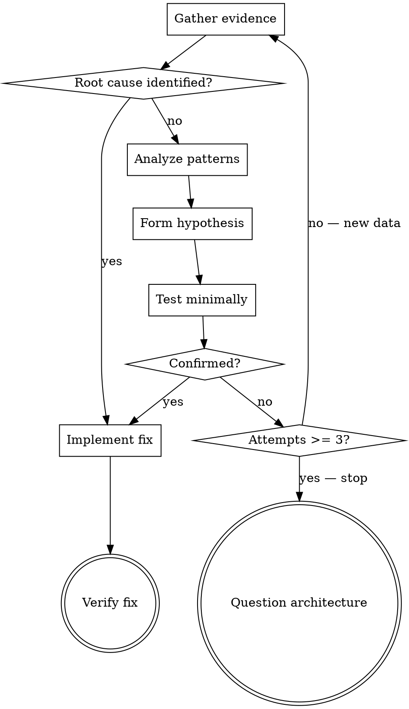

# Systematic Debugging

Find the root cause, then fix it. Guessing wastes time and creates new bugs.

## The Iron Law

```
NO FIXES WITHOUT ROOT CAUSE INVESTIGATION FIRST
```

If you have not completed Phase 1, you cannot propose fixes.

**No exceptions:**
- Not when the fix "seems obvious"
- Not when time pressure is high (systematic is faster than thrashing)
- Not when you "already know" what's wrong
- Not when someone says "just try this"

**Violating the letter of this rule IS violating the spirit.**

## When NOT to Use

- Typo in a config file you are staring at — just fix it
- Compiler error with an unambiguous message pointing to a single line
- Missing import or dependency that the error names explicitly

This skill is for bugs where the cause is not immediately visible from the error alone.

## The Debugging Loop



## Phase 1: Evidence Gathering

**BEFORE attempting ANY fix:**

### 1.1 Read the Error

- Read the full error message, stack trace, and log context — not just the summary line
- Note file paths, line numbers, error codes, timestamps
- If the error is truncated, get the full output before proceeding

### 1.2 Reproduce

- Trigger the failure with exact steps
- If it reproduces reliably, record the steps
- If it does NOT reproduce reliably, gather more data — do not guess at intermittent causes

### 1.3 Check What Changed

- `git diff` and recent commits in the affected area
- Dependency updates, config changes, environment differences
- Deployment state changes (check CI/CD systems, deployment tools)
- Related tickets or recent PRs from teammates (check issue trackers, code review tools)

### 1.4 Gather Evidence Across Boundaries

When the system has multiple components (CI -> build -> deploy, API -> service -> database, controller -> operator -> infrastructure):

```
For EACH component boundary:
  1. What data enters this component?
  2. What data exits this component?
  3. What config/environment does it expect?
  4. What is the actual state at this layer?

Run diagnostics ONCE to find WHERE it breaks.
THEN investigate that specific component.
```

**MCP-aware evidence sources** — use available integrations before manual investigation:

| Need | Check first | Manual fallback |
|------|-------------|-----------------|
| Deployment state | CI/CD or deployment MCP tools | SSH to host, check process/logs |
| Related tickets | Issue tracker MCP tools | Search web UI |
| Recent PRs in area | Code review MCP tools | `git log --oneline --all` |
| Infrastructure state | Cloud provider MCP tools | CLI commands |
| Runtime logs | Observability MCP tools | `kubectl logs`, `journalctl` |

If a tool-orchestration skill is available, invoke it to select the right evidence source for the environment.

### 1.5 Trace Backward to the Source

When the error appears deep in a call stack:

1. **Start at the symptom** — the line where execution fails
2. **Ask: what called this?** — trace one frame up the stack
3. **Ask: what value was passed?** — identify the bad input
4. **Repeat** until you reach the origin of the bad value
5. **Fix at the origin**, not at the symptom

**When manual tracing is blocked**, add diagnostic instrumentation:
- Log inputs BEFORE the failing operation (not after it fails)
- Include: actual values, `cwd`, relevant env vars, caller stack
- Use stderr in test contexts (stdout may be captured or suppressed)
- Run once, read output, remove instrumentation

**Never fix where the error appears without checking where the bad data came from.**

## Phase 2: Pattern Analysis

### 2.1 Find Working Examples

- Locate similar working code in the same codebase
- What succeeds that is structurally similar to what fails?

### 2.2 Identify Differences

- List every difference between working and broken, however small
- Do not dismiss differences as "that can't matter"
- Check assumptions about shared config, environment, and dependencies

## Phase 3: Hypothesis and Testing

### 3.1 Form a Single Hypothesis

State it explicitly: "The root cause is X because evidence Y shows Z."

**Hypothesis quality check.** Prefer structural explanations (data flow, variable lifetime, error handling paths) over timing/concurrency theories unless there is direct evidence of concurrent execution (goroutine spawning, async callbacks, thread pools) in the call path. Concurrency bugs are real but rare; variable lifecycle bugs are common. A plausible concurrency theory without concurrency evidence wastes investigation cycles.

### 3.2 Test Minimally

- Make the SMALLEST possible change to test the hypothesis
- One variable at a time — never bundle multiple changes
- If it works → Phase 4
- If it fails → form a NEW hypothesis from the new evidence. Do not stack another fix on top.

## Phase 4: Implementation

### 4.1 Write a Failing Test

- Reproduce the bug in an automated test before fixing it
- The test must fail before the fix and pass after
- If no test framework exists, write a minimal reproduction script

### 4.2 Fix the Root Cause

- ONE change addressing the identified root cause
- No "while I'm here" improvements
- No bundled refactoring

### 4.3 Add Defense-in-Depth

After fixing the source, add validation at each layer the bad data passed through:

| Layer | Purpose | Example |
|-------|---------|---------|
| Entry point | Reject invalid input at API/function boundary | Validate non-empty, correct type, exists |
| Business logic | Ensure data is semantically valid for this operation | Domain invariant checks |
| Environment guard | Prevent dangerous operations in specific contexts | Refuse destructive ops outside temp dirs in tests |
| Diagnostic logging | Capture context for future forensics | Log inputs + stack before risky operations |

One layer catches most bugs. Four layers make the bug structurally impossible.

### 4.4 Verify

- Failing test now passes
- No other tests broken
- Original symptom no longer reproducible

### 4.5 Three-Strike Rule

If three hypothesis-test cycles have failed:

**STOP.** This is not a bug in one component — it is an architectural problem.

Signs: each fix reveals new coupling, fixes require "massive refactoring," each fix creates symptoms elsewhere.

Escalate to the user before attempting fix #4. Present what you tried and what each attempt revealed.

## Condition-Based Waiting (Timing Bugs)

When the bug involves flaky tests or race conditions:

- **Replace arbitrary sleeps** with polling for the actual condition: state change, event fired, file exists, count reached
- **Always include a timeout** with a clear error message — never poll forever
- **Poll fresh state** inside the loop — do not cache state before entering
- **If a real delay is needed** (testing timed behavior), first wait for the triggering condition, then apply a documented, justified delay

## Rationalization Table

| Excuse | Reality |
|--------|---------|
| "Issue is simple, skip process" | Simple bugs have root causes. Process takes 2 minutes for simple bugs. |
| "Emergency, no time" | Systematic debugging is faster than guess-and-check. Always. |
| "Just try this first" | The first fix sets the pattern. Start right. |
| "I'll write the test after" | Untested fixes regress. Test first proves the fix. |
| "Multiple fixes at once saves time" | Cannot isolate what worked. Creates new bugs. |
| "I see the problem" | Seeing symptoms is not understanding root cause. |
| "One more attempt" (after 2+ failures) | Three-strike rule. Question the architecture. |
| "The fix is obvious from the error" | Obvious fixes at symptom sites mask root causes upstream. |
| "CI flagged these files, just fix them" | The check scope may be wrong. Compare what the check scans to what the tool covers. Fixing files you didn't intentionally change may be treating a symptom. |

## Red Flags

If you catch yourself doing any of these, STOP and return to Phase 1:

- Proposing a fix before reading the full error output
- Changing code without reproducing the bug first
- Stacking a second fix on top of a failed first fix
- Saying "it's probably X" without evidence
- Skipping the test because "it's a small change"
- Fixing where the error appears without tracing backward
- Formatting or fixing files you didn't intentionally change because a CI check flagged them

## Degrees of Freedom

| Bug Type | Evidence Depth | Approach |
|----------|---------------|----------|
| Single-file logic error | Narrow — read error, read function | Trace data flow, fix at source |
| Cross-component failure | Broad — instrument boundaries | Boundary diagnostics, find failing handoff |
| Intermittent / flaky | Deep — timing, state, environment | Reproduce under load, condition-based waiting |
| Performance regression | Broad — profiles, metrics, diffs | Measure before/after, isolate hotspot |
| "Works on my machine" | Environment-focused | Diff environments, check config/state divergence |

## After Debugging

Once the fix is verified, route to the appropriate next step:

- **Fix requires multi-step implementation** → Break it down before starting. If the task-decomposition skill is available, invoke it.
- **Root cause needs deeper investigation** → Research before concluding. If the deep-research skill is available, invoke it.
- **Root cause is a system/infrastructure issue** → Triage before fixing. If the operational-triage skill is available, invoke it.

Do not jump from debugging directly to large-scale changes. A verified root cause is an input to planning — not a license to refactor.
