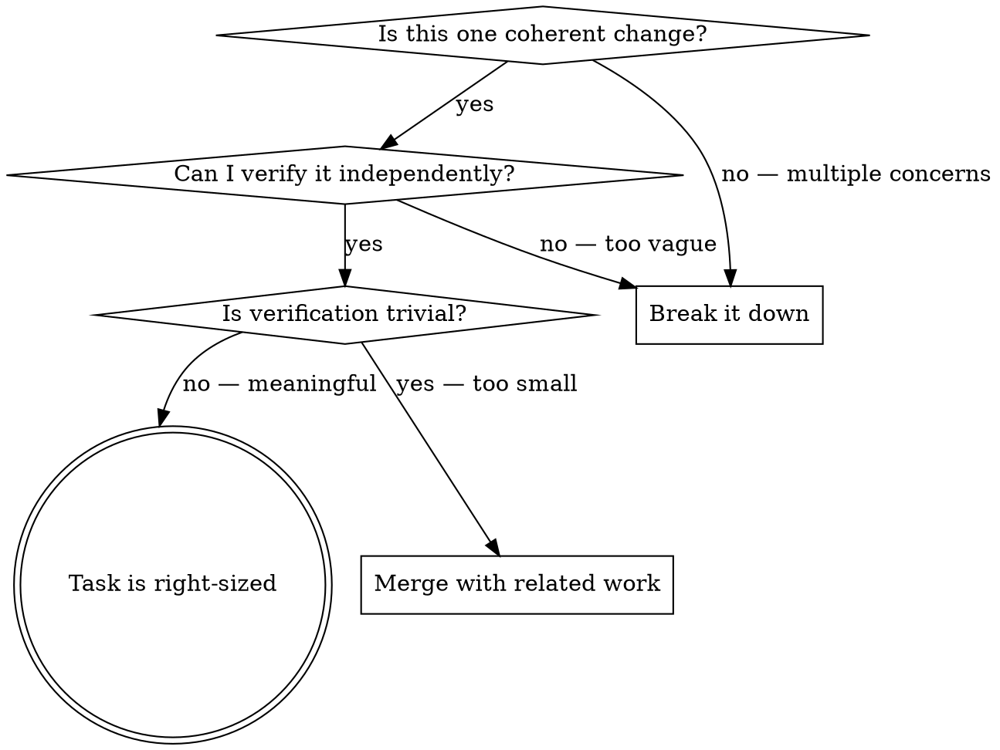
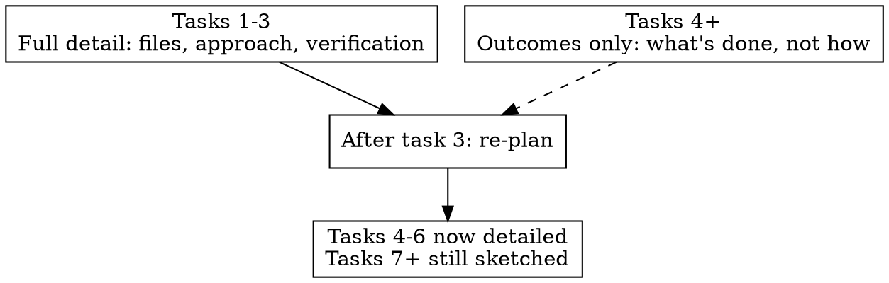

# Task Decomposition

Breaking complex work into right-sized, independently verifiable tasks.

## The Iron Law

```
STOP PLANNING WHEN YOU CAN START THE FIRST TASK
```

A plan's job is to get you moving, not to map every step before step one. You will learn things during implementation that invalidate later steps. Plan enough to start, then re-plan as you learn.

**No exceptions:**
- Not for "complex" tasks that "need thorough planning"
- Not for "making sure we don't miss anything"
- Not for "being thorough so we don't have to re-plan"
- You WILL re-plan. That's not failure — it's the process working.

## The Verification Boundary

The core concept: **each task ends at a point where you can independently verify it worked.**

A verification boundary is a natural seam where you can stop and prove progress:
- Domain types compile and pass type tests → boundary
- Parse function correctly reads files → boundary
- One harness produces correct output → boundary

These are NOT verification boundaries:
- "File created" — mechanical, proves nothing about correctness
- "Code compiles" — too low, the project should always compile
- "All tests pass" — too high for a single task, that's the finish line

**The test:** For each task, answer: "What specific command or observation proves THIS task is done?" If you can't answer concretely, the task is too vague. If the answer is trivial, the task is too small.

## Right-Sizing Tasks



**Heuristics:**
- Most work decomposes into **3-7 tasks**. Fewer than 3 = probably too coarse. More than 7 = over-decomposed or the scope is too large for one session.
- One task can touch many files. Group by **coherent change**, not by file.
- Tests are part of implementation, not separate tasks. "Write tests" is not a task — "implement X (with tests)" is.
- If variants follow the same pattern (per-harness, per-endpoint, per-model), that's ONE task with iteration, not N separate tasks.

## Planning Depth



- **Detail tasks 1-3:** Exact files, approach, verification command
- **Sketch tasks 4+:** What's done when this task completes (outcome), not how
- **After task 3:** Re-plan based on what you learned. Tasks 4+ may have changed.
- **Never detail all tasks upfront.** You're guessing about tasks you haven't started.

## Red Flags — Over-Planning

- More than 7 tasks before starting any work
- Listing each file as a separate task
- Separate "verify" or "run tests" tasks (verification is part of every task)
- Identical pattern repeated per-variant (per-harness, per-endpoint, per-model) instead of one task with iteration
- The plan took longer to produce than the first task would take to execute
- A "file summary table" or "implementation order" section — the plan is becoming a document
- Design decisions made in the plan without exploring the code first

**All of these mean: You're over-planning. Cut the plan down and start working.**

## Red Flags — Wrong Granularity

**Too coarse (task is a project):**
- "Implement the feature" — what's the FIRST verifiable step?
- "Research and design" — what specific question needs answering?
- "Update all harnesses" — what does ONE harness look like when done?

**Too fine (task is a line of code):**
- "Create file X" — what's IN it and why?
- "Add import statement" — that's part of writing code, not a task
- "Add field to struct" — unless that's the whole change, it's part of a larger task
- "Run tests" — verification, not a task

**All of these mean: Apply the verification boundary test. Find the natural seam.**

## Rationalization Table

| Excuse | Reality |
|--------|---------|
| "I need a complete plan before starting" | You need enough to start. You'll learn things that invalidate later steps. |
| "Each file change should be a separate step" | Group by coherent change, not by file. One task can touch 5 files. |
| "Tests should be their own step" | Tests prove the implementation works. They're part of the implementation task. |
| "I should list every variant" | Same pattern across N variants = one task with iteration, not N tasks. |
| "More detail = better plan" | More detail = more to invalidate. Plan what you can verify, sketch the rest. |
| "We might miss something" | You'll discover what you missed during implementation. That's faster than guessing upfront. |
| "The user asked for a thorough plan" | Thorough ≠ exhaustive. 5 right-sized tasks with verification beats 20 file-level steps. |
| "This is a complex task" | Complex tasks need LESS upfront planning, not more — uncertainty means your plan is wrong. |

## Example: Good vs. Bad Decomposition

**Bad (over-planned, file-level):**
```
1. Add Template struct to domain/content.go
2. Add Templates field to Pack in domain/profile.go
3. Add AllTemplates() method
4. Add Templates to PackManifest
5. Add Templates to PackEntry
6. Add template resolution to resolve.go
7. Add parseTemplates to engine/parse.go
8. Wire templates into resolvePackContent
9. Create template rendering in engine/template.go
10. Add template paths to Claude Code harness
11. Add template paths to OpenCode harness
12. Add template paths to Codex harness
...20 steps
```
20 steps. No verification boundaries. File-level granularity. Per-harness repetition.

**Good (verification boundaries, right-sized):**
```
1. Domain + config layer: Template type, manifest, profile resolution
   Verify: `go test ./internal/domain/... ./internal/config/...` passes

2. Parse + render: Read template files, expand {env:VAR} placeholders
   Verify: `go test ./internal/engine/...` passes, template_test.go covers expansion

3. Harness integration: All harnesses plan + write rendered templates
   Verify: `go test ./internal/harness/...` passes, sync dry-run shows template writes

4. (sketched) Capture/save support: Round-trip templates through save command
5. (sketched) End-to-end: Full sync with real pack containing templates
```
5 tasks. Each ends at a verification boundary. Per-harness work is ONE task. Tests are inline.

## After Decomposition

Once tasks are defined and the first task is ready to execute:

- **Each task** may benefit from a relevant skill based on its nature. Match task type to methodology:
  - Investigation or exploration → deep-research skill (if available)
  - Troubleshooting or diagnosis → operational-triage skill (if available)
  - Straightforward implementation → execute directly
- **After completing all tasks** → Verify the whole. Run the project's full test/lint/validate commands and confirm the original goal is met — not just that individual tasks passed.
