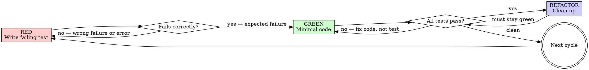

# Test-Driven Development

Write the test first. Watch it fail. Write minimal code to pass.

## The Iron Law

```
NO PRODUCTION CODE WITHOUT A FAILING TEST FIRST
```

Write code before the test? Delete it. Start over. Implement fresh from tests.

**No exceptions:**
- Do not keep it as "reference"
- Do not "adapt" it while writing tests
- Do not look at it
- Delete means delete

**Violating the letter of this rule IS violating the spirit.**

## When NOT to Use

- Throwaway prototypes explicitly labeled as such
- Generated code (edit the generator, not the output)
- Pure configuration files (YAML, JSON, TOML with no logic)
- Glue scripts under 10 lines with no branching

If you're unsure whether TDD applies, it applies.

## Red-Green-Refactor



### Step 1: RED — Write One Failing Test

Write a single test that describes the behavior you want. One assertion, one behavior.

**Requirements:**
- Name describes the behavior: `test_rejects_empty_email`, not `test1`
- Tests real code, not mocks (mocks only when external I/O is unavoidable)
- "and" in the test name? Split it into two tests

### Step 2: Verify RED — Watch It Fail

Run the test. This step is **mandatory, never skip it.**

| Language | Command |
|----------|---------|
| Go | `go test ./path/to/package/ -run TestName` |
| Python | `pytest path/to/test_file.py::test_name -v` |
| Node/TS | `npm test -- --testPathPattern=path/to/test` |
| Shell | `bats path/to/test.bats` or run the test script directly |
| Rust | `cargo test test_name` |
| Other | Use the project's existing test runner. Check Makefile, package.json, or CI config. |

**Stub new functions first.** If the test references a function that doesn't exist yet, stub it before running (return zero values, `panic("not implemented")`, or `raise NotImplementedError`). A compilation error is not valid RED — you haven't exercised the assertion.

**Confirm all three:**
1. Test **runs and fails** (not errors — compilation errors and import failures are not valid RED)
2. Failure message matches what you expect
3. Fails because the feature is missing, not because of a typo

**Test passes immediately?** You are testing existing behavior. Fix the test.

### Step 3: GREEN — Write Minimal Code

Write the simplest code that makes the test pass. Nothing more.

- Do not add parameters "for later"
- Do not handle edge cases you have not written tests for
- Do not refactor yet
- Do not touch code outside the scope of this test

### Step 4: Verify GREEN — Watch It Pass

Run the **full** test suite for the affected package/module, not just the new test.

**Confirm:**
- New test passes
- All existing tests still pass
- No warnings, no errors in output

**New test fails?** Fix the production code. Do not weaken the test.

**Existing test broke?** Fix it now, before proceeding.

### Step 5: REFACTOR — Clean Up

Only after GREEN is verified:
- Remove duplication
- Improve names
- Extract helpers

Run tests after every refactor step. Tests must stay green. Do not add new behavior during refactor.

### Step 6: Repeat

Return to RED for the next behavior.

## Test Runner Selection

```dot
digraph runner {
    start [label="What language?" shape=diamond];
    go [label="go test ./..." shape=box];
    py [label="pytest" shape=box];
    node [label="npm test / jest / vitest" shape=box];
    rust [label="cargo test" shape=box];
    shell [label="bats / shunit2" shape=box];
    other [label="Check Makefile\nor CI config" shape=box];
    run [label="Run it" shape=doublecircle];

    start -> go [label="Go"];
    start -> py [label="Python"];
    start -> node [label="JS/TS"];
    start -> rust [label="Rust"];
    start -> shell [label="Bash/Shell"];
    start -> other [label="Other"];
    go -> run;
    py -> run;
    node -> run;
    rust -> run;
    shell -> run;
    other -> run;
}
```

Always check for a project-specific test command first (Makefile `test` target, `scripts.test` in package.json, CI config). Use it over generic commands.

## Testing Anti-Patterns

### Never test mock behavior

Asserting that a mock was called, or that a mock element exists, tells you nothing about real behavior. If you must mock (external API, database, network), assert on the **outcome** of your code, not on the mock itself.

**Gate:** Before any assertion involving a mock — ask: "Am I testing my code's behavior, or the mock's existence?" If the latter, delete the assertion.

### Never add test-only methods to production code

Methods that exist only for test cleanup, test inspection, or test setup pollute the production API. Put test utilities in test files or a test helper package.

**Gate:** Before adding a method to production code — ask: "Is this called outside of tests?" If no, move it to test utilities.

### Never test language builtins or trivial pass-through

Asserting that `len([]int{1, 2}) == 2` tests the language, not your code. A RED test must exercise your function's contract boundary — its interaction with real inputs, edge cases, or state. If removing your function wouldn't change the test outcome, the test is worthless.

**Gate:** Before declaring RED — ask: "Does this test fail because MY code's behavior is wrong, or because a language builtin would need to misbehave?" If the latter, rewrite to test the actual contract.

### Never mock without understanding dependencies

Mocking "to be safe" or "because it might be slow" breaks tests that depend on side effects of the mocked code. Understand what the real method does before replacing it.

**Gate:** Before mocking any method:
1. What side effects does the real method have?
2. Does this test depend on any of those side effects?
3. If yes — mock at a lower level, preserving the behavior your test needs

## Rationalization Table

| Excuse | Reality |
|--------|---------|
| "Too simple to test" | Simple code breaks. Test takes 30 seconds. |
| "I'll test after" | Tests passing immediately prove nothing — you never saw them catch the bug. |
| "Tests after achieve same goals" | Tests-after = "what does this do?" Tests-first = "what should this do?" Different question, different quality. |
| "Already manually tested" | Ad-hoc, no record, cannot re-run. Manual does not equal systematic. |
| "Deleting X hours is wasteful" | Sunk cost fallacy. Keeping unverified code is the real waste. |
| "Keep as reference, write tests first" | You will adapt it. That is tests-after in disguise. Delete means delete. |
| "Need to explore first" | Fine. Throw away the exploration. Then start with TDD. |
| "Hard to test = unclear requirements" | Hard to test = hard to use. Listen to the test. Simplify the interface. |
| "TDD will slow me down" | TDD is faster than debugging. Measure wall-clock time including debug cycles. |
| "This is different because..." | No, it is not. |

## Red Flags — Stop and Start Over

- Wrote production code before writing a test
- Test passes on first run (you are testing existing behavior or the test is wrong)
- Cannot explain why the test failed
- Rationalizing "just this once"
- Adding tests "later" as a follow-up task
- Saying "keep as reference" about pre-written code
- Mock setup is longer than the test logic
- Asserting on mock existence instead of real behavior

**All of these mean: delete the code, start over with RED.**

## Degrees of Freedom

| Situation | Approach |
|-----------|----------|
| New feature | Full TDD cycle — RED, GREEN, REFACTOR for each behavior |
| Bug fix | Write a test that reproduces the bug (RED), fix it (GREEN), refactor |
| Refactoring existing code | Ensure tests exist first. If not, add characterization tests, then refactor under green. |
| Legacy code with no tests | Add tests for the specific behavior you are changing. Do not boil the ocean. |
| Spike / exploration | Write throwaway code. Delete it. Start over with TDD. The spike informed your understanding, not your implementation. |
| Performance optimization | Write a benchmark test that captures current behavior. Optimize under green. |

## Verification Checklist

Before declaring implementation complete:

- Every new function/method has a test that failed before implementation
- Each test failed for the expected reason (missing feature, not typo or import error)
- Minimal code written to pass each test — no speculative features
- Full test suite passes with clean output
- Tests use real code (mocks only for external I/O boundaries)
- Edge cases and error paths have their own tests

Cannot check all boxes? You skipped TDD. Start over.

## After TDD

Once the implementation is complete and all tests pass:

- **Tests reveal a system-level issue** (infrastructure, deployment, environment) — invoke the operational-triage skill if available
- **Implementation needs debugging** (tests pass but behavior is wrong in integration) — invoke the systematic-debugging skill if available
- **Done** — apply the verification-before-completion rule before declaring the task complete

Do not skip the final verification gate. "Tests pass" is necessary but not sufficient — the verification-before-completion rule confirms the change is actually done.
