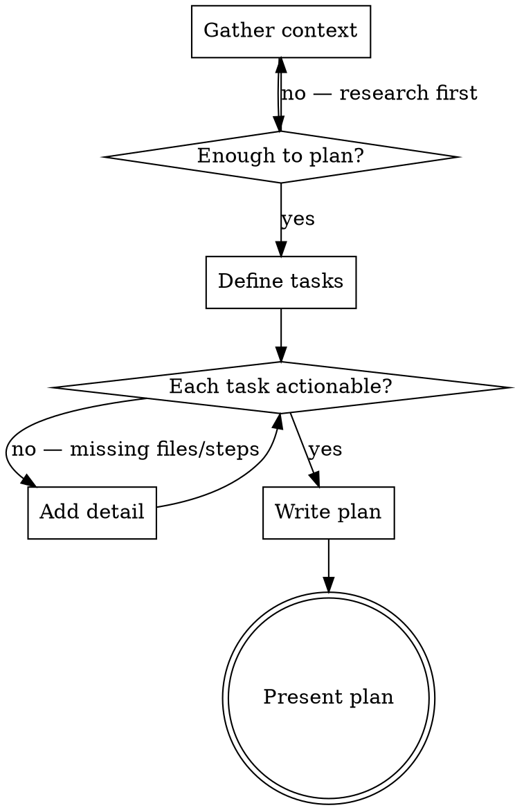

# Writing Plans

Create implementation plans assuming the implementer is skilled but knows NOTHING about this codebase.

## The Iron Law

```
EVERY TASK MUST BE COMPLETABLE IN MINUTES, NOT HOURS
```

A plan that says "implement the feature" is a wish. A plan that says "add this function to this file, test it with this command, expect this output" is actionable. If the implementer has to explore the codebase to figure out what to do, the plan failed.

**No exceptions:**
- Not for "simple" changes that "don't need detail"
- Not for tasks where "the implementer will figure it out"
- Not for steps that are "obvious from context"
- If you haven't specified exact files and verification, it's not a plan

**Violating the letter of this rule IS violating the spirit.**

## When NOT to Use

- Single-file changes with obvious implementation — just do it
- Bug fixes where you already know the root cause and the fix — just fix it
- Work that needs exploration before you can plan — use deep-research first
- Tasks that need scope definition, not implementation detail — use task-decomposition first

This skill is for turning UNDERSTOOD requirements into EXECUTABLE plans.

## The Planning Flow



### Step 1: Gather Context

Before writing any plan, build a concrete picture of the codebase:

1. **Identify the project's structure** — read config files, manifests, directory layout
2. **Find the test runner and linter** — exact commands the project uses
3. **Read existing code** at the points where changes will land — not just the entry point, but the files you'll modify
4. **Check for patterns** — how does existing code handle similar concerns? Follow those patterns.

Use available tools (file search, code search, MCP integrations) to gather this context. Do not plan from assumptions about project structure.

### Step 2: Define Tasks

Break the work into tasks where each task:
- Is one coherent change (may touch multiple files)
- Ends at a verification boundary — a point where a specific command proves it worked
- Follows TDD when the project has tests: write test → verify it fails → implement → verify it passes → commit

**Target: 3-7 tasks.** Fewer than 3 means tasks are too coarse. More than 7 means the scope is too large or tasks are too granular.

### Step 3: Write the Plan

Present the plan in conversation. Persist to a file only if requested.

## Plan Format

````markdown
# [Feature Name] Implementation Plan

**Goal:** [One sentence — what is done when the plan is complete]

**Architecture:** [2-3 sentences — approach and key design decisions]

**Test/lint commands:** [Exact commands used to verify throughout]

---

### Task 1: [Descriptive Name]

**Files:**
- Create: `exact/path/to/new_file.py`
- Modify: `exact/path/to/existing.py`
- Test: `tests/exact/path/to/test_file.py`

**Step 1: Write the failing test**

```python
def test_specific_behavior():
    result = function(input)
    assert result == expected
```

**Step 2: Run test — expect FAIL**

Run: `pytest tests/path/test_file.py::test_specific_behavior -v`
Expected: FAIL — `NameError: name 'function' is not defined`

**Step 3: Implement**

```python
def function(input):
    return expected
```

**Step 4: Run test — expect PASS**

Run: `pytest tests/path/test_file.py::test_specific_behavior -v`
Expected: PASS

**Step 5: Commit**

```bash
git add tests/path/test_file.py src/path/new_file.py
git commit -m "feat: add specific behavior"
```

---

### Task 2: [Next Task]
...
````

**Non-negotiable elements in every task:**
- Exact file paths (not "the config file" — which config file)
- Complete code (not "add validation" — what validation, exactly)
- Exact verification commands with expected output
- Commit step with specific message and file list

## Red Flags — Bad Plans

| Symptom | Problem |
|---------|---------|
| "Implement the handler" without code | Plan is a TODO list, not a plan |
| "Update tests as needed" | Which tests? What assertions? Be specific. |
| "See existing patterns" | Copy the relevant pattern INTO the plan |
| File paths with wildcards or "etc." | The implementer will guess wrong |
| No verification commands | No way to know if a task succeeded |
| Tasks that take more than 15 minutes | Break them down further |
| Design decisions deferred to implementer | Decide now or research first |

## Rationalization Table

| Excuse | Reality |
|--------|---------|
| "The implementer can figure out the details" | They can't — they have zero codebase context. Spell it out. |
| "This is too simple to need a full plan" | Then don't use this skill. If you're using it, write the full plan. |
| "I'll add the test details later" | Tests ARE the plan. Without them, you have a sketch. |
| "The exact file paths might change" | Use the paths that exist NOW. The implementer can't act on hypotheticals. |
| "I don't want to over-specify" | Under-specification forces the implementer to explore. That's YOUR job. |
| "There are too many tasks to detail" | Scope is too large. Break into phases, plan the first phase only. |

## Degrees of Freedom

| Situation | Approach |
|-----------|----------|
| Greenfield feature | Full TDD cycle per task, strict ordering |
| Modification to existing code | Show before/after for each change point |
| Refactor | Prove behavior preservation with tests FIRST, then restructure |
| Config/infrastructure change | Verification = status commands, not unit tests |
| Multi-language or multi-service | One task per service boundary, integration task at the end |

## After Planning

Once the plan is written, route to the appropriate next step:

- **Plan is ready to execute** → If the executing-plans skill is available, invoke it. Otherwise, execute tasks sequentially, verifying each before starting the next.
- **Plan reveals unknowns that block task detail** → Investigate before proceeding. If the deep-research skill is available, invoke it for the specific unknowns.
- **Scope is larger than expected (>7 tasks)** → Decompose into phases. If the task-decomposition skill is available, invoke it to break the work into plannable chunks.

Do not hand off a plan with vague tasks. Every task in the plan must pass the Iron Law before execution begins.
