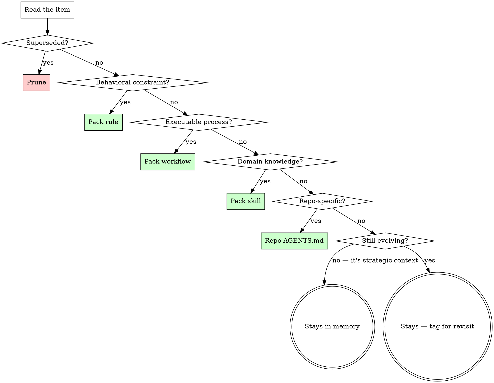

# Knowledge Hygiene

Classification framework for identifying misplaced knowledge across persistence locations.

## The Iron Law

```
KNOWLEDGE IN THE WRONG PLACE IS KNOWLEDGE THAT DOESN'T WORK
```

A behavioral constraint stored in memory instead of a pack rule won't fire when needed. Repo-specific architecture docs stored in personal memory won't help the next person who clones that repo. Strategic context crammed into a pack rule wastes tokens on every interaction.

**The cost isn't duplication — it's silence.** Misplaced knowledge fails quietly. The agent doesn't error; it just doesn't have the right context at the right time.

## Classification Categories

Every knowledge item falls into exactly one category. If you're torn between two, apply the **primary purpose test**: what is this item's job? To constrain behavior (rule), to guide a process (workflow), to provide on-demand context (skill), to help repo contributors (repo docs), or to inform future decisions (memory)?

| Category | Signals | Correct home |
|----------|---------|-------------|
| **Behavioral constraint** | Trigger-action pairs, imperative voice ("do X when Y", "never Z"), agent misbehavior correction | Pack rule (<60 lines) or rule seed + skill |
| **Executable process** | Numbered steps, tool invocations, decision gates, mutation checkpoints | Pack workflow |
| **Domain knowledge** | Reference material, methodology, classification frameworks, on-demand context | Pack skill |
| **Repo-scoped context** | Architecture, dependency direction, build commands, coding conventions for ONE codebase | That repo's AGENTS.md / CLAUDE.md |
| **Strategic context** | Decisions, direction, positioning, stakeholder notes, multi-project plans | Persistent memory |
| **Stale/superseded** | Explicitly replaced, contains dead paths/tools/versions, or says "see X instead" | Delete (after confirming replacement exists) |

## Maturity Signals

How to tell when a memory-stored observation has matured into something that belongs elsewhere:

| Signal | Interpretation |
|--------|---------------|
| Needed in 2+ sessions | Durable enough for pack content or repo docs |
| Contains imperative voice | It's already a rule — just misplaced |
| Contains numbered steps | It's already a workflow — just misplaced |
| Has been refined or corrected | The refined version is canonical — persist in its correct home |
| References specific repo paths, packages, or architecture | Repo-scoped — belongs in that repo's agent config |
| Explicitly says "authoritative source is now..." | Superseded — prune the copy |
| Duplicates content in a pack or repo doc | One SSOT — delete the duplicate |

## Routing Decision Tree



## Anti-Examples (Observed Misrouting)

These are real cases, not hypotheticals. Each was found during an audit of accumulated knowledge stores.

| What was stored | Where it landed | Why it was wrong | Correct destination |
|----------------|-----------------|------------------|-------------------|
| Legacy methodology doc that says "superseded by pack skill" | Persistent memory/reference | Explicitly superseded — SSOT is the pack | Delete |
| Go package architecture + dependency direction for one repo | Persistent memory/projects | Repo-specific developer context | That repo's AGENTS.md |
| "Agent can't fix X — tell user to run Y" pattern | Persistent memory/known-issues | Trigger-action pair = behavioral constraint | Pack rule or skill facet |
| Pack design principles (runtime model, survivability rules) | Persistent memory/reference | Pack authoring methodology | Pack skill (content-craft or similar) |
| Design direction for agent architecture | Persistent memory/strategy | Legitimately strategic — informs future decisions | Stays (correct placement) |

## Rationalization Table

| Excuse | Reality |
|--------|---------|
| "It's fine in memory — I can find it" | YOU can find it. The agent can't load it at the right time. Placement determines availability. |
| "It's not mature enough for a pack" | Apply the maturity signals. If it has imperative voice or numbered steps, it's already mature — just misplaced. |
| "I'll move it later" | Later never comes. That's how knowledge debt accumulates. |
| "It's sort of strategic AND sort of a rule" | Apply the primary purpose test. What is its JOB? Constrain behavior → rule. Inform decisions → memory. |
| "Moving it might break something" | Memory items have no consumers. Pack content and repo docs have defined load paths. Moving TO the right place creates availability; it doesn't break anything. |
| "This is a known issue, not a rule" | If it contains "when you see X, do Y" — that's a behavioral constraint regardless of what file it's in. |

## Transform Guidance

When migrating content, it usually needs reformatting for its destination:

| From → To | Transform |
|-----------|-----------|
| Memory observation → Pack rule | Extract trigger-action pairs. Imperative voice. Cut context/history. <60 lines. |
| Memory process notes → Pack workflow | Number the steps. Add exact tool/command per step. Add mutation gates. Cut narrative. |
| Memory reference → Pack skill | Write CSO description (triggers only). Structure body as reference. <500 lines. |
| Memory architecture notes → Repo AGENTS.md | Focus on what a contributor needs: structure, conventions, build/test commands, dependency direction. Cut project history. |
| Superseded content → Delete | Confirm replacement exists and is current. Then delete — no tombstone needed. |

## Persistent Memory Convention

When knowledge passes through the routing decision tree and lands in "Stays in memory," use the memory-bank rule and skill (in this pack) for structure, file format, categories, and protocol. This skill handles classification only — the memory-bank skill is the SSOT for how memory is organized.

### Memory is the default bucket — challenge it

Before writing to persistent memory, re-check:

- Does it contain trigger-action pairs ("when X, do Y")? → It's a rule, not memory.
- Does it contain numbered steps or a repeatable process? → It's a workflow, not memory.
- Does it describe a methodology or reference framework? → It's a skill, not memory.
- Does it describe one repo's architecture, conventions, or build system? → It's AGENTS.md, not memory.

If it's genuinely strategic context, project status, a known issue, a permanent constraint, or an observation not yet confirmed as durable — then it belongs in memory.
